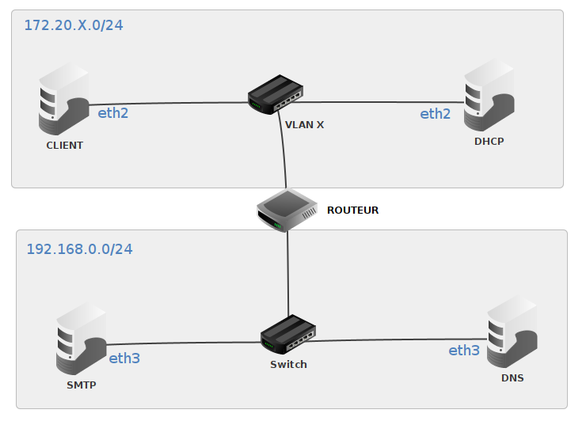

# SAÉ S203 - Installation de services réseaux

## Présentation du sujet

Cette SAÉ aura pour objectif
- de configurer un VLAN, un LAN et une interconnexion de réseaux ;
- d’installer, configurer et déployer un serveur DHCP ainsi qu’un serveur SMTP.

Elle se découpera en 3 parties :
- Partie 1 : configuration d’un LAN et d’un VLAN et mise en place d’un routage statique entre ces réseaux ;
- Partie 2 : configuration d’un serveur DHCP sur le VLAN ;
- Partie 3 : configuration d’un serveur SMTP sur le LAN.

## Modalités

* Travail en binôme (librement constitué). Principalement en autonomie.
* Chaque groupe de TP bénéficie de trois sessions de 4h en salle machine. Ces sessions sont planifiées sur 3 semaines. En 2025-2026, semaines 21 à 23.
* Un enseignant sera disponible pour répondre à vos questions durant le 2e créneau des 2 premières sessions.
* Chacune des parties donne lieu à des livrables distincts. Les échéances de livraisons sont les suivantes : 
  * Livrable 1 : Les réalisations de la partie 1 seront à livrer le soir de la 2e session.
  * Livrable 2 : Les réalisations de la partie 2 seront à livrer le soir de la 3e session.
  * Livrable 3 : Les réalisations de la partie 3 seront aussi à livrer le soir de la 3e session.  
* La procédure de livraison est la suivante : 
  - créer un répertoire `TP_NOM1-NOM2_L` où 
    * `TP` désigne votre groupe de `TP` (`TP-1-1`, `TP-1-2`, `TP-2-1`…), 
    * `NOM1` et `NOM2` sont respectivement les noms de famille des membres du binôme, 
    * et `L` désigne le numéro du livrable (`L1`, `L2` ou `L3`) ;
  - copier y vos réalisations, 
  - créer une archive `TP_NOM1-NOM2_L.tar.gz` contenant ce répertoire 
  - et enfin déposer le fichier obtenu sur l’espace dédié sur madoc. 

La commande example suivante vous sera utile :

	tar -czvf TP-0-0_HERNANDEZ-REMM_L1.tar.gz TP-0-0_HERNANDEZ-REMM_L1/ 

* Le nom des fichiers est imposé. 
* Le format des rapports est aussi imposé. Il s’agit du format [Markdown](https://fr.wikipedia.org/wiki/Markdown). Ce format permet facilement de copier-coller les commandes/codes. Utiliser les squelettes des fichiers proposés `rapport1.md`, `rapport2.md` et `rapport3.md` suivant les parties. 
* Évaluation sur la base des livrables. La documentation produite doit permettre à une personne informaticienne qui ne connaît pas le sujet de mettre en place les services ou configurations réseau rapportées. Il ne vous est pas demandé de rapporter les actions et commandes en lien avec l'environnement virtualisé de l'IUT. A contrario, indiquer les manipulations de configuration qui ne sont pas nécessaires dans l'environnement virtualisé mais utiles en théorie ; vos sujets de TP les mentionnent. Le non-respect des consignes sur la forme (e.g. la casse des noms, le format des fichiers) sera sanctionné.

## Mise en œuvre

* Un identifiant `X` vous est attribué individuellement (cf. fichier `identifiants-X.pdf` sous madoc). Dans vos réalisations, vous choisirez librement un seul des identifiants à votre disposition dans votre binôme. Vous conserverez le même pour toutes les questions.
* Par ailleurs, vous avez reçu par mail un mot « *secret* » ; celui-ci est privé et vous authentifie. Dans vos réalisations, vous utiliserez la concaténation de vos mots (ordre alphabétique) ; cette concaténation sera désignée sous le terme de `SECRET`.
* Ci-dessous un schéma (incomplet) de l’organisation du réseau que vous aurez à mettre en place.

* La machine `DNS` vous est fournie configurée. Il s'agit de la VM `ro-dns-sae203` (que vous ajouterez avec la commande `vm-tp-add` et que vous n'oublierez pas de démarrer).
Son IP est `192.168.0.254/24`. Un serveur de noms (DNS) y est déployé pour la zone `mailX.com` avec `X` votre identifiant.
* Toutes les IP non spécifiées dans le sujet sont laissées à votre libre choix dans la mesure où les contraintes du sujet sont respectées.
* Utiliser des VM avec un système debian c-a-d en ajoutant la VM à votre espace avec la commande `vm-add -d MACHINE` (avec `-d` avant le nom des machines virtuelles que vous voulez créer).

## Environnement

Lorsque vous ajoutez une VM, celle-ci vient avec une configuration réseau permettant à la VM d'exister sur l'Internet : une adresse IP est active sur l'interface `host0`, des routes sont présentes et notamment une route par `default`, les IPs de serveurs DNS permettant la résolution de nom de domaine de l'Internet public sont aussi configurés dans `/etc/resolv.conf`. 

L'accès de base à Internet doit être préservé autant que possible pour vous permettre d'installer de nouveaux paquets, ou vous connecter depuis la Silverblue à une VM avec Wireshark (`vm-tcpdump`). Normalement à aucun moment vous devriez supprimer ou désactiver l'interface `host0`. Il se peut par contre que vous ayez des routes à ajouter ; cela ne posera pas de problème à moins qu'au final vous ayez plusieurs routes par défaut. Là il vous faudra trouver une solution. De la même manière, même si vous modifiez votre configuration DNS, dans l'idéal vous devrez essayer de préserver la configuration existante ; cela peut être utile pour le bon fonctionnement de la commande `vm-tcpdump`. 

## Travail à réaliser

**Partie 1** : 
La configuration réseau est statique. Il n’y a pas de serveur `DHCP` à installer dans cette partie. Le plan d’adressage doit respecter le schéma et les consignes de mise en oeuvre donnés ci-avant. 
- Mettre en place un `VLAN X` (où `X` est votre identifiant) entre 3 machines nommées ici `CLIENT`, `DHCP` et `ROUTEUR`. 
- Mettre en place un `LAN` entre les machines `ROUTEUR`, `SMTP` et `DNS`. Sur ce réseau, le `ROUTEUR` aura l’adresse `192.168.0.X`. La machine `SMTP` aura l’`IP` retournée par le serveur `DNS` de ce réseau pour le nom de domaine  `smtpX.mailX.com`.
- Interconnecter le `LAN` et le `VLAN` afin que les machines `CLIENT`, `DHCP`, `ROUTEUR` et `SMTP` puissent se joindre.

**Partie 2** : 
- Installer et configurer un serveur `DHCP` sur la machine du même nom. Celui-ci doit fournir une route vers la machine `ROUTEUR`, le nom de domaine “`SECRET.org`” (où `SECRET` désigne la concaténation de vos secrets), et l’`IP` suivante du serveur `DNS` `192.168.0.254`. Suite à une demande au serveur `DHCP`, la station `CLIENT` doit se voir délivrer une adresse fixe en fonction de son adresse `MAC`.

**Partie 3** :
- Configurer un serveur `SMTP` sur la machine `SMTP` du `LAN` `192.168.0.0/24`. 

## Livrables

Attention, pour toutes les parties, l'environnemment en machines virtuelles de l'IUT vous facilite la vie pour quelques tâches. Lors des différents TPs il vous a été indiqué que certaines installations de paquets/modules, configuration de fichiers ou de paramètres n'étaient pas nécessaires dans notre environnement. Il faudra néanmoins indiquer dans vos rapports ces actions théoriques (vous reporter aux sujets de TP pour les connaître) ; les mentionner en précisant leur objectif est suffisant. 

Pour la première partie :
- Rédiger un document  (`rapport1.md`) regroupant votre plan d’adressage (i.e. la description des différents `LAN`, de leur interconnexion, des machines avec les `IP` voire `@MAC` que vous jugerez pertinentes), les tables de routage de `CLIENT`, `ROUTEUR`, `SMTP` et celle (supposée) de `DNS`, les commandes à réaliser sur CLIENT, `ROUTEUR`, `SMTP`, et tout ce qui vous semble nécessaire à la configuration de votre réseau ;
- Fournir une capture de trames (`vlan.pcapng`) démontrant « la traversée du VLAN entre la machine `CLIENT` et la machine `DHCP` ». Compléter votre rapport avec une section (## Analyse capture de trames - VLAN) d’une ½ page maximum qui explique ce que l’on est censé observer en se référant aux identifiants des trames qui illustrent votre propos ;
- Fournir une capture de trames (`dns.pcapng`) démontrant « la résolution `DNS` via `ROUTEUR` depuis la machine `CLIENT` pour le nom `smtpX.mailX.com` ».  Compléter votre rapport en ajoutant une section  (## Analyse capture de trames - DNS) d’une ½ page maximum qui explique ce que l’on est censé observer en se référant aux identifiants des trames qui illustrent votre propos.
- Fournir les captures de trames de deux points différents du réseau (`routage_1.pcapng` et `routage_2.pcapng`) démontrant qu'il y a bien un routage entre la machine `CLIENT` et la machine `SMTP`. Compléter votre rapport avec une section (## Analyse capture de trames - routage) d’une ½ page maximum qui indique sur quelles machines/interfaces les captures ont été réalisées, et qui explique ce que l’on est censé observer en se référant aux identifiants des trames qui illustrent votre propos. 
- Fournir le résultat de la commande `./log > MACHINE.log`, où `MACHINE` correspond à la machine sur laquelle doit être exécutée la commande avec les droits root, et doit être remplacée successivement par `CLIENT`, `DHCP`, `ROUTEUR` et `SMTP`.

Pour la deuxième partie :
- Rédiger un « manuel utilisateur » (`rapport2.md`) d’une à deux pages pour installer et configurer un serveur `DHCP`. Une personne sans expérience d’installation ni de configuration de service doit être capable de le faire en suivant le manuel (description globales des étapes et détails sur les différentes machines, commandes à exécuter, codes à modifier, commandes de test à réaliser, résultats à observer, etc.). Votre manuel doit être complet e.g. si votre service requiert une configuration réseau alors votre manuel doit aussi l'expliquer. Indiquer explicitement les adresses IP et éventuellement les adresses MAC des machines que vous utilisez si c’est pertinent ;
- Fournir une capture de trames (`dhcp.pcapng`) illustrant une “session DHCP entre la machine `CLIENT` et le serveur `DHCP` ». Compléter le manuel utilisateur en ajoutant une documentation technique sous la forme d’une section  (## Analyse capture de trames - DHCP) d’une ½ page maximum qui explique ce que l’on est censé observer en se référant aux identifiants des trames qui illustrent votre propos.
- Fournir le résultat de la commande `./log > CLIENT.log`, à exécuter depuis la machine `CLIENT` avec les droits root.
- Fournir le résultat de la commande `./log > DHCP.log`, à exécuter depuis la machine `DHCP` avec les droits root.

Pour la troisième partie : 
- Fournir une capture de trames (`smtp.pcapng`) démontrant « l’envoi d’un mail depuis la machine `CLIENT` sur le serveur `SMTP` ». Le corps du mail devra contenir sur une ligne la liste des éléments suivants séparés par une virgule : vos noms de famille (tels qu’écrit dans le fichier “`identifiants-X.pdf`”), la valeur de votre `SECRET` et de votre `X`. Si par exemple JF Remm a pour mot secret “`sun`” et pour identifiant “`123`”, que N Hernandez a pour mot secret “`iss`" et pour identifiant “`111`”, que leurs noms dans le fichier `identifiants-X.pdf` sont écrits en majuscule, alors s’ils choisissent le `X` de JF Remm, le corps de leur mail sera le suivant : `REMM, HERNANDEZ, isssun, 123`
- Accompagner la capture d’une brève documentation fonctionnelle (rapport3.md)  d’une page maximum qui indique d’une part les opérations que vous avez dû réaliser pour déployer le serveur dans le réseau (sans pour autant rentrer dans tous les détails techniques), et d’autre part d’expliquer ce que l’on est censé observer dans la capture en se référant aux trames qui illustrent votre propos.
