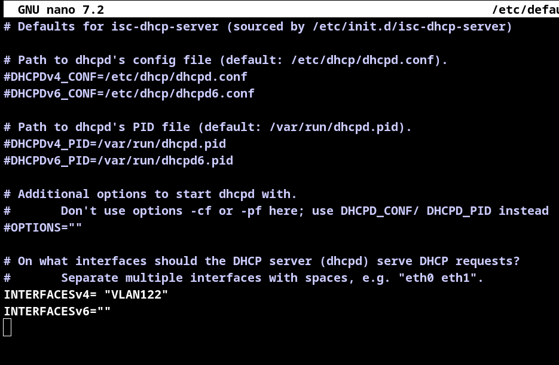
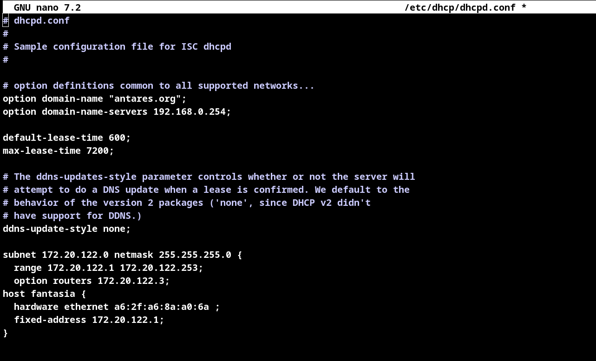

# Manuel utilisateur

* NOMS : CHAMSIDDINE Abdullah - PISSOT CLément
* GROUPE de TP :  TP1
* X : 122
* SECRET : antares
* IP_CLIENT : 172.20.122.1/24
* IP_DHCP : 172.20.122.2/24
* IP_SMTP : 192.168.0.22/24
* IPs du ROUTEUR : 172.20.122.3/24 et 192.168.0.122/24


**Note**: Ce document, d’une à deux pages, doit décrire comment configurer un serveur DHCP. 
Une personne ne sachant pas configurer ce service doit être capable de le faire en suivant le manuel (description globales des étapes et détails sur les différentes machines, commandes à exécuter, codes à modifier, commandes de test à réaliser, résultats à observer, etc.). Votre manuel doit être complet e.g. si votre service requiert une configuration réseau alors votre manuel doit aussi l'expliquer. Indiquer explicitement les adresses IP et éventuellement les adresses MAC des machines que vous utilisez si c’est pertinent.

pour mettre en place le dhcp il faut faire plusieurs etapes cruciales:

Pour faire sa, on va commencer étapes par étapes:

# mettre en place la `VLAN` dans le **dhcp**: 

* 1) créer la vlan dans `dhcp` :

```` bash
	#creer la vlan dans l'interface eth2
	ip link a  link eth2 name VLAN122 type vlan id 122
````
* 2) activé l'interface physique :

````bash 
	# activer l'eth2
	ip link set up dev eth2
````
* 3) activé cette fois ci la VLAN:

````bash
	ip link set up dev VLAN122
````
* 4) affecter l'adresse 172.20.122.2/24 au `dhcp` la VLAN:

````bash
	ip a a 172.20.122.2/24 dev VLAN122
````
# exécuter le dns :

dans le noyau ubuntun :

* exécuté le `dns`:

````bash
 vm-run ro-dns-sae20
````

# mettre en place le routeur:
## Partie VLAN:

 1) mettre en place la VLAN sur un cote du routeur:

````bash
ip link a link eth2 name VLAN122 type vlan id 122
````
 2) active l'interface physique :

````bash 
ip link set up dev eth2
```` 
 3) activé l'interface virtuelle:

````bash 
 ip link set up dev VLAN122
````
 4) affecter l'adresse 172.20.122.3/24 dans le VLAN

````bash 
ip a a 172.20.122.3/24 dev VLAN122
````
## Partie ETH3 :

 1) affecter l'adresse 192.168.0.122/24 dans l'interface `ETH3`:

````bash
ip a a 192.168.0.122/24 dev eth3 
````
 2) activer l'interface `eth3`:

````bash 
 ip link set up dev eth3
````
# 3) test `ping` :

````bash
#ping le dhcp 
ping 172.20.122.2

#ping le dns après l'avoir activé
ping 192.168.0.254
````

## mis en activation du dhcp:

 1) installe les paquet `isc-dhcp-server`:

````bash 
apt install isc-dhcp-server
```` 

 2) configuration dde l'interface par defaut :

````bash
nano /etc/default/isc-dhcp-server
# puis change l'interface IPV4 avec l'interface virtuelle:
INTERFACESv4= "VLAN122"
````

````bash
#puis configure le dhcp dans le etc/dhcp/dhcpd.conf
nano etc/dhcp/dhcpd.conf
# comme ceci
````

# Attention !!!  vueillez à ce que tous sois correct pour éviter des error lors du demarage du système.
# 2) active le systeme :
toujours dans le dhcp, activez le système du dhcp:

````bash 
systemctl start isc-dhcp-server
````

ensuite on peut passe au `client`:

1) mettez en place la VLAN :

````bash
ip link a link eth2 name VLAN122 type vlan id 122
````
2) et activez l'interface physique et virtuelle
````bash 
# interface physique
ip link set up eth2

# interface virtuelle
ip link set up VLAN122
````
et la on peut faire la requette pour demende une adresse ip au dhcp.
3)  demande une adresse ip avec la commende `dhclient`

```` bash
dhclient vlan122
````

# Analyse capture de trames(DHCP)
dans la capture, on peut voir 4 trames.

la premier un message DHCP Discover du client, qui envoie ce message au broadcast,car il chercher un server DHCP car il veut demande un adresse IP , particulierement celui la(172.20.122.1/24).

dans le deuxièmes trames,correspond a un DHCP offer, le DHCP repond au CLIENT et lui propose d'adresse qu'il avais demande mais lui fournie des information sur le masque , la passerelle, le DNS etc ..

dans la troisièmes, corespond a un DHCP requestion , à laquelle le CLIENT accepte la proposition du serveur et demande officellement l'attribution de l'adresse id 172.20.122.1/24.

et dans la quatrièmes , corespond au DHCP ACK , et là le DHCP lui confirme l'attribution de l'adresse IP 