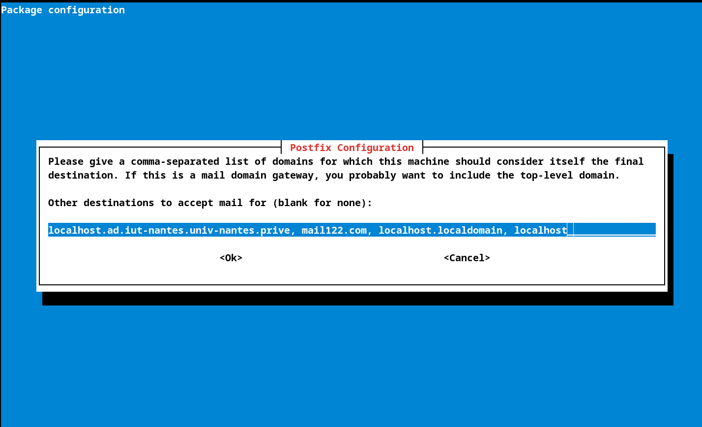
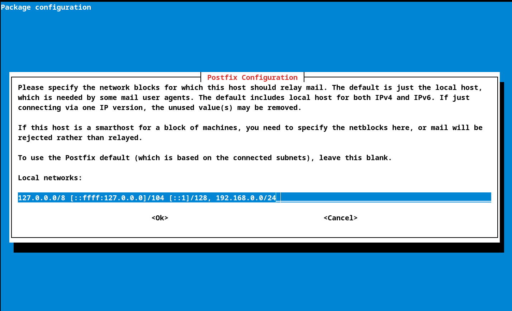
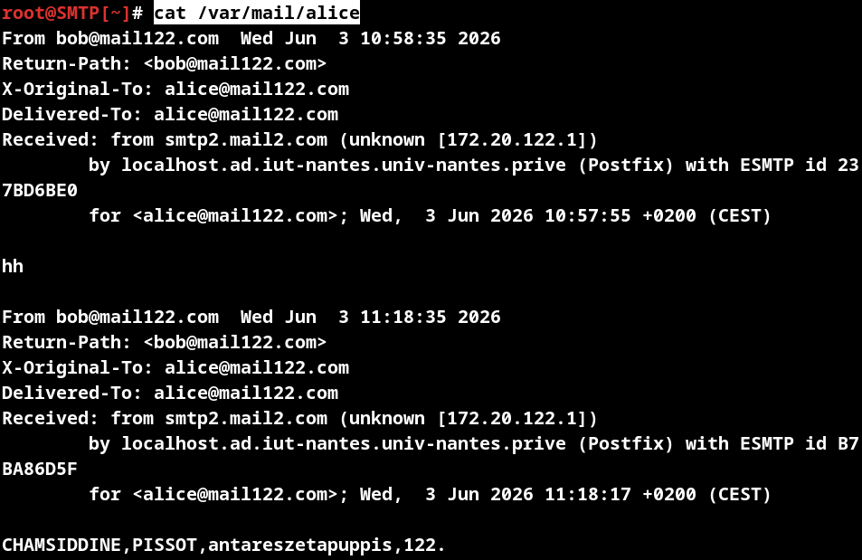

# Analyse session SMTP

* NOMS : Chamsiddine Abdullah - Clément Pissot
* GROUPE de TP :  TD-1
* X : 122
* SECRET : antareszetapuppis
* IP_CLIENT : 172.20.122.1/24
* IP_DHCP : 172.20.122.2/24


### a faire:

* capture de trame de la machine client vers le serveur smtp

* y identifier :
- les nom de fammilles
- la valeur de notre secret plus notre X
- le resultat devrait resemblé a: ABDULAH, PISSOT, antareszetapuppis, 122

* expliquer dans les grandes ligne comment on a fait pour crée le le serveur reseaux
* expliquer la capture d'écran

# comment on si est pris:

# Partie SMTP

## I) crée l'utilisateur :

1) créer utilisateur **alice** dans la vm `SMTP`:

    ````bash 
    adduser alice
    ````
## II) install / configuration les paquets necessaire
1)  rajouter packet necessaire :

    ````bash 
    #install le paquet
    apt install postfix
    #puis le configue
    dpkg-reconfigure postfix
    ````


2) Configurer le `postfix`:

    * aller dans la partie `site internet`
    puis le configure de cette manier la en suivant les different etapes.

        *  rajouter le nom du courrier du système `mail122.com`.
    
        * rajouter d'adresse `mail122.com` sur la liste des domaines.
        
        * rajouter le réseaux internes :
        
        * et finir par selection le protocols `ipv4`.
        
3) mettre en route le SMTP :
    * après avoir terminer la configuration faire la commande `systemcl reload postfix`.

        ````bash 
        systemcl reload postfix 
        ````

# Partie CLIENT

## I) Creation de l'utilsateur dans la VM `CLIENT`:

1) créer l'utilisateur bob  
    ````bash
    adduser bob
    ````
## II) Envoie de mail :

### dans la VM `CLIENT`.

1) créer une connexion avec le `SMTP` avec la commande `netcat`:

    ````bash 
    nc smtp122.mail122.com smtp
    ````
2) démarrer une session SMTP avec la commende `ehlo`.
    ````bash
    ehlo smtp122.mail122.com
    ````
3) et ensuite precise le expediteur dans notre cas **`bob`**
    ````bash 
    mail from: bob@mail122.com
    ````
4) puis le precise le destinateur dans notre cas **`alice`**.
    ````bash
    rcpt to: alice@mail122.com
    ````
5) puis a ce moment la on peut ecrire le contenu de notre menace avec `data`.
    ````bash
    data
    #puis ecrire le contenu.
    CHAMSIDDINE,PISSOT,antareszetapuppis,122
    # et finir par un point pour "dire que on n'a fini"
    .
    ````
6) et on finit par **``quit``**
    ````bash 
    quit
    ````


### III) Verification de l'envoie du mail.

Pour verifier que le mail a etais mien envoyer.

on va aller regard au pres de `SMTP`.
en regard le contenu de `/var/mail/alice`

````bash 
cat /var/mail/alice
````
voici le resutat en temps normal:


    


#  capture de trame:


On peut voir deux machines communiquer avec les adresses IP suivantes :

* `172.20.122.1`, qui correspond à la machine CLIENT ;
* `192.168.0.22`, qui correspond à la machine SMTP.

La première ligne est probablement la plus différente des autres.  
Elle est envoyée par la machine CLIENT vers l’adresse `192.168.0.254`, qui correspond au DNS. C’est une requête DNS : le CLIENT demande au DNS à quelle adresse IP correspond le nom `smtp122.mail122.com`.

Dans les trames 2 à 4, ce sont des trames TCP. Elles établissent une connexion TCP avec un `SYN` dans la trame 2, un `SYN-ACK` dans la trame 3, puis un `ACK` dans la trame 4.

Ensuite, le serveur SMTP répond qu’il est prêt dans la trame 5.

C’est à partir de là que l’on commence à voir les trames liées à l’envoi du mail.  
Dans la trame 7, le CLIENT envoie une requête SMTP avec `EHLO smtp122.mail122.com`. Le serveur SMTP répond ensuite avec la liste des fonctionnalités qu’il possède.

Dans la trame 11, le CLIENT précise l’adresse de l’expéditeur. Le serveur SMTP lui répond `OK` dans la trame suivante.

Dans la trame 14, le CLIENT précise l’adresse du destinataire du mail, puis le serveur SMTP lui répond `OK`.

Ensuite, dans la trame 17, le CLIENT précise qu’il va écrire le contenu du message avec la commande `DATA`. Le serveur SMTP lui répond qu’il attend le contenu du message.

Dans la trame 20, le CLIENT envoie le contenu du message. Dans la trame 22, le CLIENT précise la fin du mail avec le caractère `.`.

Pour finir, dans les trames 24 à 27, le serveur SMTP répond qu’il a accepté le message et qu’il sera envoyé.

Les trames 29 et 30 correspondent à la fin de la communication.
