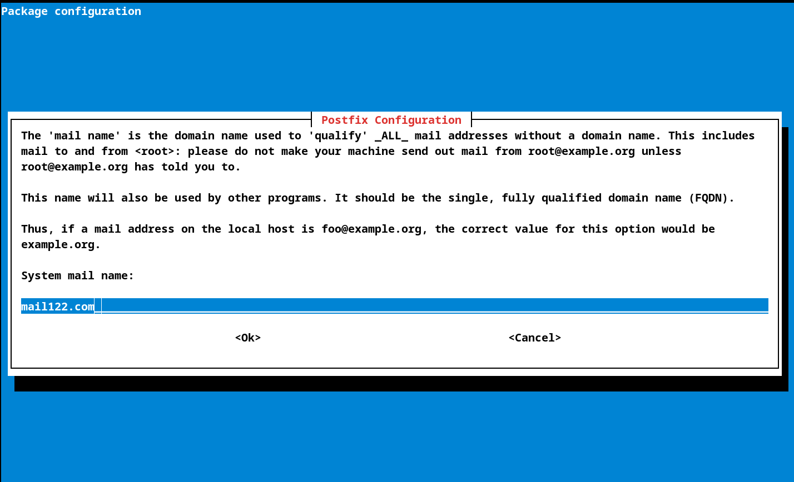
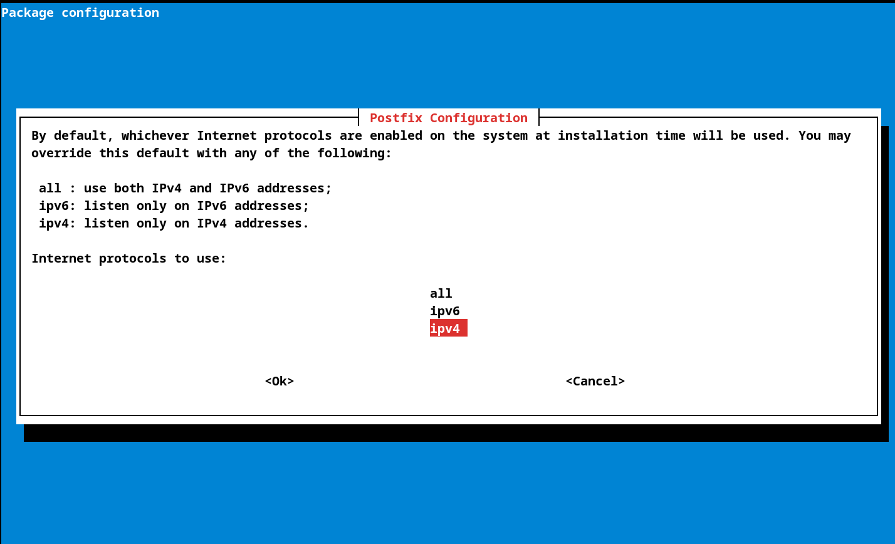

# Analyse session SMTP

* NOMS : Chamsiddine Abdullah - Clément Pissot
* GROUPE de TP :  TD-1
* X : 122
* SECRET : antareszetapuppis
* IP_CLIENT : 172.20.122.1/24
* IP_DHCP : 172.20.122.2/24

### a faire:

* capture de trame de la machine client vers le serveur smtp

* y identifier :
- les nom de fammilles
- la valeur de notre secret plus notre X
- le resultat devrait resemblé a: ABDULAH, PISSOT, antareszetapuppis, 122

* expliquer dans les grandes ligne comment on a fait pour crée le le serveur reseaux
* expliquer la capture d'écran

# comment on si est pris:

## pour la partie SMTP

* pour crée l'utilisateur :

adduser alice

* rajouter packet:

apt install postfix

dpkg-reconfigure postfix

* configurer le postfix:

aller dans site internet

écrire le configurer comme suivant 

puis apuyer sur continuer

apres avoir terminer la configuration faire la commande 

systemcl reload postfix 

## partier client

* crée utilisateur:

adduser bob

#  capture de trame:

on peut voir deux machine comuniquer avec les adresse IP suivante:

* 172.20.122.1 qui corespond a la machine client
* 192.168.0.22 qui corespond a la machine SMTP

la première ligne est probablement la plus diférents des autres.
elle est envoyer par la machine client vers l'adresse 192.168.0.254 qui corespond au DNS
et est un protocole DNS (qui est le seul de la trame).
il permet le transpore d'un message pour l'adresse smtp122.mail122.com.
puis commence l'envoi du mail en lui meme.
il va passer par localhost.ad.iut-nantes.univ-nantes.prive.
on aprend que le message viens de l'adresse mail bob@mail122.com et a été recu par l'adresse alice@mail122.com.
l'entièreter des tramee envoyer sont de protocole TCP et SMTP.
