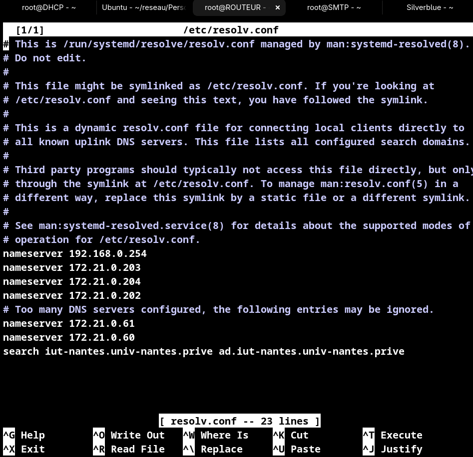

# Configuration réseau

* NOMS : Chamsiddine Abdullah - Clément Pissot
* GROUPE de TP :  TD-1
* X : 122
* SECRET : antareszetapuppis
* IP_CLIENT : 172.20.122.1/24
* IP_DHCP : 172.20.122.2/24
* IP_SMTP : 192.168.0.22/24(SMTP)
* IPs du ROUTEUR : 172.20.122.3/24 et 192.168.0.122/24

**Note**: Le document suivant doit rendre compte de votre plan d’adressage (i.e. la description des différents LAN, de leur interconnexion, des machines avec les IP voire @MAC que vous jugerez pertinentes), de vos tables de routage de CLIENT, ROUTEUR, SMTP et celle (supposée) de DNS, des commandes à réaliser sur CLIENT, ROUTEUR, SMTP, et tout ce qui vous semble nécessaire à la configuration de votre réseau.

# 1) configuration et information du système

## Plan d'adressage (en graphe si possible)

dans la **VLAN122** nous avons :

* **Client**:
	* IP: 172.20.122.1/24
	* Mac : a6:2f:a6:8a:a0:6a
	* Interface : VLAN122@eth2
* **DHCP**: 
	* IP :172.20.122.2/24
	* Mac : b2:85:3f:11:33:8e
	* Interface : VLAN122@eth2
* **ROUTAGE**:
	* IP : 172.20.122.3/24
	* mac : a6:91:8e:18:43:60
	* Interface : VLAN122@eth2

dans le **eth3**  nous avans :

*	ROUTEUR : 
	* IP : 192.168.0.122/24
	* Mac : 6e:22:cf:5e:3a:4e
	* Interface : ETH3
* SMTP :
	* IP : 192.168.0.22/24(SMTP)
	* Mac : d2:57:73:55:76:59
	* Interface : ETH3
	
* DNS :
	* IP : 192.168.0.254/24
	* Mac : 
	* Interface : ETH3

## Tables de routage

**Note**: il existe des générateurs de tables MDhttps://www.tablesgenerator.com/markdown_tables

## pour le **CLIENT**(172.20.122.1) :

| **destination** | **iface** | **gw** |
|-----------------|-----------|--------|
|172.20.122.2/24(DHCP)  |VLAN122|        |
|172.20.122.3/24(ROUTEUR)  |VLAN122|        |
|192.168.0.22/24(SMTP) |ETH3|172.20.122.3|
|192.168.0.254(DNS)|ETH3|172.20.122.3|

## pour le **DHCP**(172.20.122.1) :

| **destination** | **iface** | **gw** |
|-----------------|-----------|--------|
|172.20.122.1/24(CLIENT)  |VLAN122|        |
|172.20.122.3/24(ROUTEUR)  |VLAN122|        |
|192.168.0.22/24(SMTP) |ETH3|172.20.122.3|
|192.168.0.254(DNS)|ETH3|172.20.122.3|

## pour le **ROUTEUR**(192.168.0.122 |172.20.122.3 ) :

| **destination** | **iface** | **gw** |
|-----------------|-----------|--------|
|172.20.122.2/24(DHCP)  |VLAN122|        |
|172.20.122.1/24(CLIENT)  |VLAN122|        |
|192.168.0.22/24(SMTP) |ETH3||
|192.168.0.254(DNS)|ETH3||

## pour le **SMTP**(192.168.0.22) :

| **destination** | **iface** | **gw** |
|-----------------|-----------|--------|
|172.20.122.2/24(DHCP)  |VLAN122| 192.168.0.122|
|172.20.122.1(Client)|VLAN122|192.168.0.122|
|192.168.0.122/24(ROUTEUR)  |ETH3|        |
|192.168.0.254(DNS)|ETH3||

## Commandes de configuration

Connaître sa configuration réseau 

    ip a 
pour créer la route entre le CLIENT et le SMTP: 
	
	ip r a 192.168.0.22 via 172.20.122.3 dev VLAN122
	
	ip r a 172.20.122.2 via 192.168.0.122 dev eth3

	nslookup smtp122.mail122.com 192.168.0.254

demande au dsn l'adresse ip qui est associe a cette adresse mail:

	host smtp122.mail122.com 192.168.0.254
donne le droit d'executer le fichier log :

	chmod +x log
executer le log depuis la VM CLIENT:

	./log > CLIENT.log
	
	nano /etc/resolv.conf
	nameserver 192.168.0.254

Creer la vlan :

	ip link a link eth2 name VLAN122 type vlan id 122

	
	
Pour active l'interface:

	ip link set up dev eth2	

# 2) Capture de la trame du VLAN allant du client vers le DHCP ainsi que son explication

Veuillez trouver ci-joint le fichier **vlan_entre_client_et_DHCP.pcapng**.

Voici la capture du VLAN entre notre machine cliente et notre machine DHCP.
On peut y voir deux adresses IP qui communiquent successivement :

* **172.20.122.1**, qui correspond à la machine cliente ;
* **172.20.122.2**, qui correspond au serveur DHCP.

Le contenu de ces échanges est de type *ping* et passe par notre VLAN ayant l’identifiant **122**.

# 3) Visualisation de la résolution DNS via le routeur depuis le client

Veuillez trouver ci-joint le fichier **dns_via_routeur_depuis_client.pcapng**.

Voici la capture de la résolution DNS via le routeur depuis la machine cliente.
On peut y voir les communications entre deux machines :

* **172.20.122.1**, qui correspond à notre machine cliente ;
* **192.168.0.254**, qui correspond au serveur DNS.

Les quatre premiers échanges correspondent au protocole DNS :

1. Le premier correspond à une requête concernant l’utilisateur sous le nom **smtp122.mail122.com**.
2. Le deuxième est la réponse du serveur DNS indiquant qu’il reconnaît désormais **smtp122.mail122.com** sous le nom **machine122.mail122.com**, et qu’il peut être joint à l’adresse IP **192.168.0.22** (qui correspond au serveur SMTP).
3. Le troisième correspond à une nouvelle requête de la machine cliente utilisant son nouveau nom.
4. Le quatrième est la réponse du serveur DNS indiquant que **machine122.mail122.com** est désormais reconnu comme nom principal de la machine cliente.

# 4) Démonstration du routage entre la machine cliente et le serveur SMTP

Veuillez trouver ci-joint les fichiers **routage_1.pcapng** pour la capture côté machine cliente et **routage_2.pcapng** pour la capture côté machine SMTP.

Nous pouvons voir un ensemble de messages correspondant à des *ping* effectuant des allers-retours entre les deux machines.

Les deux adresses IP visibles sont :

* **172.20.122.1**, qui correspond à la machine cliente ;
* **192.168.0.22**, qui correspond à la machine SMTP.

Le premier message provient de la machine cliente à destination de la machine SMTP et correspond à une requête *ping* passant par un VLAN virtuel.

Le deuxième message est la réponse de la machine SMTP, qui passe également par le même VLAN virtuel.
